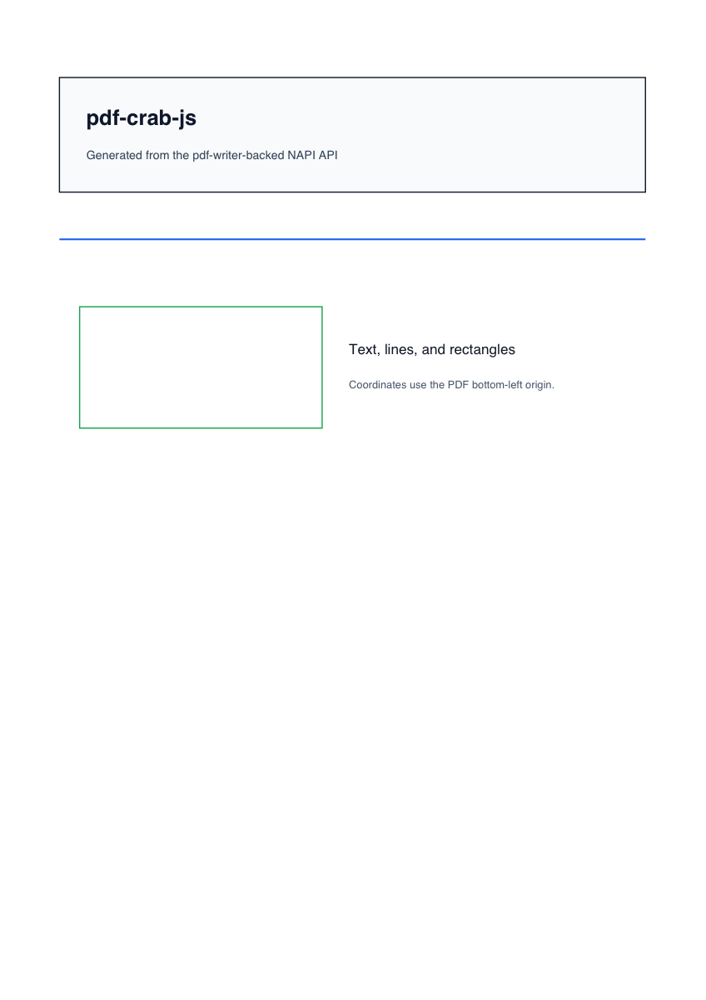

# pdf-crab-js Examples

Runnable examples for generating structured PDFs with `pdf-crab-js`.

## PDF Results

Simple document from `pdf.ts`:



Table document from `table.ts`:


## Run

Run the Node examples from the repository root:

```bash
pnpm --filter pdf-crab-js-examples example
pnpm --filter pdf-crab-js-examples example:table
```

The generated PDFs are written to `examples/pdf-crab-js/output/`.

Run the browser WASM example:

```bash
pnpm --filter pdf-crab-js-examples browser
```

Open `/wasm/` on the dev-server URL printed by Vite. The page previews a structured
`CreatePdfInput` object and renders it into a PDF iframe. The browser example imports
`pdf-crab-js/browser.js`; Vite aliases the generated `pdf-crab-js-wasm32-wasi` package entry to the
local WASI browser build during development.

## Screenshot Maintenance

Regenerate the PDFs, then refresh the screenshot thumbnails:

```bash
pnpm --filter pdf-crab-js-examples example
pnpm --filter pdf-crab-js-examples example:table
qlmanage -t -s 1200 -o examples/pdf-crab-js/screenshots examples/pdf-crab-js/output/pdf-crab-js-example.pdf
qlmanage -t -s 1200 -o examples/pdf-crab-js/screenshots examples/pdf-crab-js/output/pdf-crab-js-table-example.pdf
```
