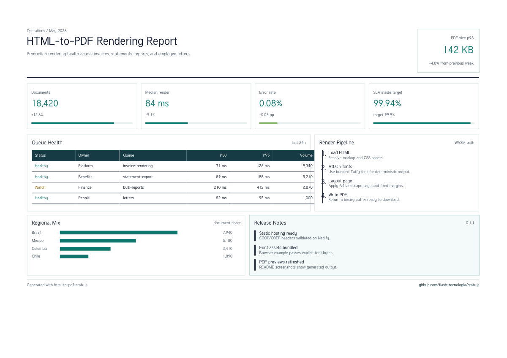
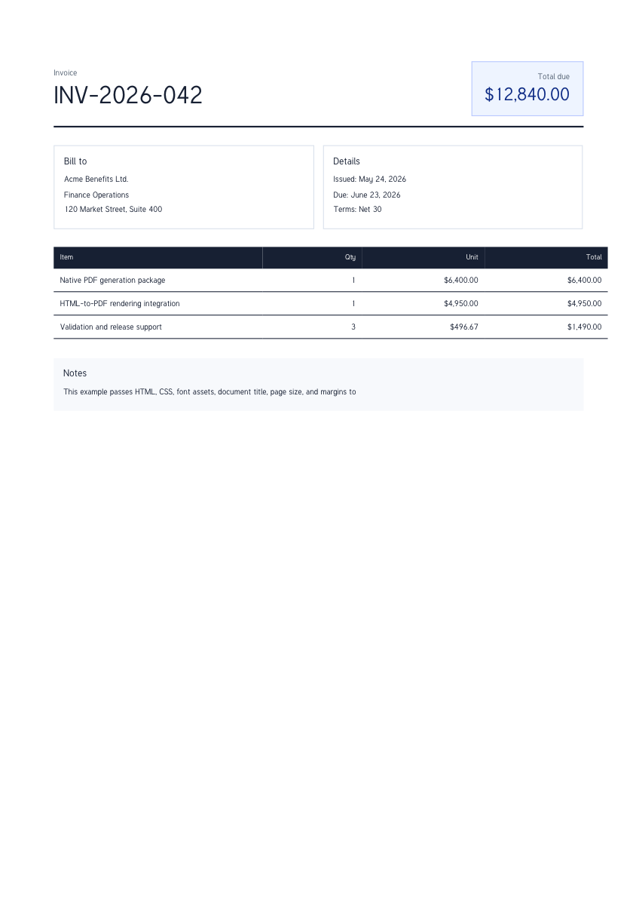

# html-to-pdf-crab-js

Chromium-free HTML-to-PDF rendering for Node.js and WebAssembly, built with Rust and NAPI-RS.

Use this package when the source document is already HTML and CSS: invoices, reports, printable
screens, exports, letters, and documents that benefit from normal web layout. If you need low-level,
coordinate-based PDF generation, use [`pdf-crab-js`](../pdf-crab-js/README.md).

`html-to-pdf-crab-js` is the easy HTML path in the Crab JS PDF stack. It converts HTML/CSS to PDF
without running Chromium, Puppeteer, Playwright, or a Gotenberg service. The rendering pipeline is
native Rust exposed through NAPI-RS, with a WASM build for browser and portable runtimes.

## Why html-to-pdf-crab-js

- Keep authoring documents in HTML and CSS instead of translating layouts into PDF coordinates.
- Avoid a heavyweight browser process or external conversion service for common document exports.
- Pass explicit CSS, fonts, images, page size, margins, and orientation through one small API.
- Use the same package family as `pdf-crab-js`: HTML/CSS for convenience, structured PDF for
  maximum speed.

## Benchmark Snapshot

Local 10-page benchmark, fastest to slowest by execution time:

| Order | Language                | Mode       | Execution time |       Throughput |
| ----- | ----------------------- | ---------- | -------------: | ---------------: |
| 1     | Node + pdf-crab         | local      |       4.116 ms | 2429.253 pages/s |
| 2     | Node + pdf-crab         | builder    |       4.232 ms | 2362.863 pages/s |
| 3     | Node + html-to-pdf-crab | local-html |      62.327 ms |  160.443 pages/s |
| 4     | Node + Gotenberg        | gotenberg  |     128.304 ms |   77.940 pages/s |

Benchmark results are workload and machine dependent. The important comparison is practical:
`html-to-pdf-crab-js` keeps the HTML/CSS workflow while avoiding Chromium service overhead. It is
not as fast as `pdf-crab-js` because it still performs HTML/CSS layout, but it is the simpler path
when HTML is already the document source.

## PDF Results

These previews are generated from `examples/html-to-pdf-crab-js/report.ts` and
`examples/html-to-pdf-crab-js/invoice.ts`.





## Install

```bash
npm install html-to-pdf-crab-js
```

Requirements:

- Node.js `>=22` for the native package.
- A browser or static host with `SharedArrayBuffer` enabled for the WASM package.

## Quick Start

```js
import { readFileSync, writeFileSync } from 'node:fs'
import { createPdfFromHtml } from 'html-to-pdf-crab-js'

const html = readFileSync('invoice.html', 'utf8')
const css = readFileSync('invoice.css', 'utf8')
const font = readFileSync('assets/Tuffy.ttf')

const pdf = await createPdfFromHtml({
  html,
  css,
  fonts: [font],
  basePath: process.cwd(),
  page: {
    size: 'A4',
    margin: { top: 14, right: 14, bottom: 16, left: 14, unit: 'mm' },
  },
  systemFonts: false,
  title: 'Invoice INV-2026-042',
})

writeFileSync('invoice.pdf', pdf)
```

CommonJS is also supported:

```js
const { createPdfFromHtml } = require('html-to-pdf-crab-js')
```

## API

| Export                     | Description                           |
| -------------------------- | ------------------------------------- |
| `createPdfFromHtml(input)` | Renders HTML/CSS into a PDF `Buffer`. |

### `CreatePdfFromHtmlInput`

| Field         | Description                                                                                                   |
| ------------- | ------------------------------------------------------------------------------------------------------------- |
| `html`        | Required HTML document string. Must not be empty.                                                             |
| `title`       | Optional PDF title.                                                                                           |
| `css`         | Optional CSS string or array of CSS strings.                                                                  |
| `basePath`    | Optional base path for resolving relative assets. Must not be empty when provided.                            |
| `systemFonts` | Enables host system fonts when `true`; defaults to `true`. Use `false` for deterministic bundled-font output. |
| `fonts`       | Optional array of font buffers in Node. Browser WASM examples normalize binary font assets to base64.         |
| `images`      | Optional named image assets. Names are referenced from HTML/CSS asset paths.                                  |
| `page`        | Optional page size, margins, and orientation.                                                                 |
| `bookmarks`   | Enables or disables generated bookmarks when supported by the renderer.                                       |
| `tagged`      | Enables or disables tagged PDF output when supported by the renderer.                                         |
| `pdfUa`       | Enables or disables PDF/UA mode when supported by the renderer.                                               |

### Page Options

```ts
type HtmlPdfPageInput = {
  size?: 'A4' | 'LETTER' | 'A3' | { width: number; height: number; unit?: 'mm' | 'pt' }
  margin?: number | { top: number; right: number; bottom: number; left: number; unit?: 'mm' | 'pt' }
  landscape?: boolean
}
```

A numeric `margin` is interpreted as millimeters. Custom page sizes and margin objects support
`mm` and `pt`.

## Fonts and Assets

For reliable rendering, pass explicit fonts and set `systemFonts: false`:

```js
const font = readFileSync('assets/Tuffy.ttf')

await createPdfFromHtml({
  html,
  css,
  fonts: [font],
  systemFonts: false,
})
```

`basePath` is useful when the HTML references local assets with relative paths. For browser WASM,
see `examples/html-to-pdf-crab-js/wasm/browser.ts`; it fetches font bytes and converts them before
calling the WASI binding.

## Browser and WASM

Browser, Deno, Bun, and portable runtimes can use the NAPI-RS WebAssembly build:

```js
import { createPdfFromHtml } from 'html-to-pdf-crab-js/wasm'
```

Browser deployments must enable `SharedArrayBuffer`, which requires cross-origin isolation:

```text
Cross-Origin-Embedder-Policy: require-corp
Cross-Origin-Opener-Policy: same-origin
```

The combined Netlify browser sample lives in `examples/netlify-pdf-samples/` and demonstrates
`html-to-pdf-crab-js` with `pdf-crab-js` using the required WASM headers.

Published sample: https://pdf-crab-js.netlify.app/#html-to-pdf-crab-js

## Examples

Run the Node examples from the workspace root:

```bash
pnpm --filter html-to-pdf-crab-js-examples invoice
pnpm --filter html-to-pdf-crab-js-examples report
```

Generated files are written to `examples/html-to-pdf-crab-js/output/`.

Run the browser WASM example:

```bash
pnpm --filter html-to-pdf-crab-js-examples browser
```

Open `/wasm/` on the local Vite server. The page previews `report.html` and renders that same
HTML/CSS into a PDF iframe.

Preview the source HTML in a browser:

```bash
open examples/html-to-pdf-crab-js/invoice.html
open examples/html-to-pdf-crab-js/report.html
```

## Development

Install dependencies from the workspace root:

```bash
pnpm install --filter html-to-pdf-crab-js
```

Build and test:

```bash
pnpm --filter html-to-pdf-crab-js build
pnpm --filter html-to-pdf-crab-js test
pnpm --filter html-to-pdf-crab-js check
pnpm --filter html-to-pdf-crab-js lint
pnpm --filter html-to-pdf-crab-js fmt:check
```

Build and smoke-test the WebAssembly binding:

```bash
rustup target add wasm32-wasip1-threads
pnpm --filter html-to-pdf-crab-js build:wasm
pnpm --filter html-to-pdf-crab-js test:wasm
```

## Release

Native and WebAssembly package publishing is handled by `napi prepublish -t npm`.
