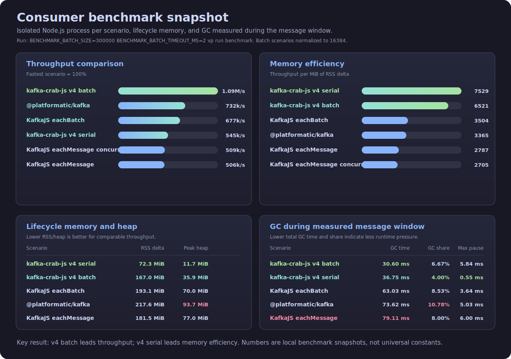

# Kafka Crab JS

Kafka Crab JS is a native Kafka client for Node.js and TypeScript. It uses Rust, NAPI-RS, and librdkafka to reduce
JavaScript heap pressure, expose Kafka's mature native client behavior, and push high-throughput consumer workloads
through a small TypeScript-friendly API.

[](https://www.npmjs.com/package/kafka-crab-js)
[](https://opensource.org/licenses/MIT)

## Why Kafka Crab JS?

KafkaJS is a strong default for many Node.js services. Kafka Crab JS is for the cases where Kafka throughput, memory
pressure, native batching, or librdkafka behavior start to matter.

| Need                                | What Kafka Crab JS Provides                                                              |
| ----------------------------------- | ---------------------------------------------------------------------------------------- |
| Higher consumer throughput          | Native batch receive paths and Web Stream batch consumers.                               |
| Lower JavaScript heap pressure      | Message fetch and Kafka protocol work happen in Rust/librdkafka before crossing into JS. |
| Predictable Kafka offset handling   | `commitMessage()` commits `message.offset + 1`, the value Kafka expects.                 |
| Production Kafka tuning             | Advanced librdkafka settings are passed through with their original names.               |
| Node.js ecosystem integration       | Direct APIs, Node.js `Readable` streams, native Web Streams, and CommonJS/ESM exports.   |
| Observability without core coupling | Diagnostics-channel events power the optional `kafka-crab-js-otel` package.              |

In the local isolated consumer benchmark snapshot, `kafka-crab-js v4 (stream, batch)` reached about
`1.09M messages/sec`, ahead of the measured `@platformatic/kafka` and KafkaJS batch scenarios, while using less peak heap
than both. Treat benchmark numbers as workload-specific; the full methodology and memory/GC breakdown are documented in
[Performance Benchmarks](#performance-benchmarks).

## Highlights

- Native librdkafka client exposed through a TypeScript-friendly API.
- Producer, direct consumer, Node.js `Readable` stream, and native Web Stream consumer APIs.
- High-throughput batch receive APIs for workloads that can process more than one message at a time.
- Manual commit helpers that commit `message.offset + 1` correctly.
- Optional diagnostics-channel instrumentation for OpenTelemetry through `kafka-crab-js-otel`.
- Advanced librdkafka settings are forwarded through `configuration` without forcing a custom allowlist.

## Requirements

- Node.js `>= 22`.
- A Kafka broker reachable from the Node.js process.
- No separate librdkafka install is required for the published binaries.

## Table Of Contents

1. [Installation](#installation)
2. [Module Usage](#module-usage)
3. [Quick Start](#quick-start)
4. [Message Model](#message-model)
5. [Choosing A Consumer API](#choosing-a-consumer-api)
6. [Producer API](#producer-api)
7. [Consumer API](#consumer-api)
8. [Stream Consumers](#stream-consumers)
9. [Batching, Backpressure, And Tuning](#batching-backpressure-and-tuning)
10. [Configuration](#configuration)
11. [OpenTelemetry](#opentelemetry)
12. [Performance Benchmarks](#performance-benchmarks)
13. [Migration Notes](#migration-notes)
14. [Troubleshooting](#troubleshooting)
15. [Development](#development)
16. [License](#license)

## Installation

```bash
npm install kafka-crab-js
```

```bash
pnpm add kafka-crab-js
```

```bash
yarn add kafka-crab-js
```

## Module Usage

The package publishes both ESM and CommonJS entry points:

```ts
import { KafkaClient } from 'kafka-crab-js'
import type { Message, ProducerRecord } from 'kafka-crab-js'
```

```js
const { KafkaClient } = require('kafka-crab-js')
```

The public TypeScript types are generated from the native NAPI contract and the JavaScript wrapper. Runtime enum-like
values such as commit modes and security protocols are string literals, not runtime objects:

```ts
await consumer.commitMessage(message, 'Sync')

const client = new KafkaClient({
  brokers: 'localhost:9092',
  securityProtocol: 'Plaintext',
})
```

## Quick Start

### Produce Messages

```ts
import { KafkaClient } from 'kafka-crab-js'

const client = new KafkaClient({
  brokers: 'localhost:9092',
  clientId: 'orders-api',
  securityProtocol: 'Plaintext',
})

const producer = client.createProducer()

const metadata = await producer.send({
  topic: 'orders',
  messages: [
    {
      key: Buffer.from('order-123'),
      payload: Buffer.from(JSON.stringify({ id: 'order-123', status: 'created' })),
      headers: {
        'content-type': Buffer.from('application/json'),
      },
    },
  ],
})

console.log(metadata)
```

### Consume One Message At A Time

```ts
import { KafkaClient } from 'kafka-crab-js'

const client = new KafkaClient({
  brokers: 'localhost:9092',
  clientId: 'orders-worker',
  securityProtocol: 'Plaintext',
})

const consumer = client.createConsumer({
  groupId: 'orders-worker',
  enableAutoCommit: false,
  configuration: {
    'auto.offset.reset': 'earliest',
  },
})

await consumer.subscribe('orders')

try {
  while (true) {
    const message = await consumer.recv()
    if (!message) {
      break
    }

    const value = JSON.parse(message.payload.toString('utf8'))
    console.log({ value, topic: message.topic, partition: message.partition, offset: message.offset })

    await consumer.commitMessage(message, 'Sync')
  }
} finally {
  await consumer.disconnect()
}
```

### Consume In Batches

```ts
const consumer = client.createConsumer({
  groupId: 'orders-batch-worker',
  enableAutoCommit: false,
  configuration: {
    'auto.offset.reset': 'earliest',
  },
})

await consumer.subscribe('orders')

try {
  while (true) {
    const batch = await consumer.recvBatch(500, 50)
    if (batch.length === 0) {
      continue
    }

    for (const message of batch) {
      await processOrder(message.payload)
      await consumer.commitMessage(message, 'Async')
    }
  }
} finally {
  await consumer.disconnect()
}
```

## Message Model

Messages use `Buffer` values because the Kafka protocol treats keys, payloads, and headers as bytes. Decode them at the
edge of your application instead of assuming text:

```ts
import type { Message, MessageProducer, RecordMetadata } from 'kafka-crab-js'

const outgoing: MessageProducer = {
  key: Buffer.from('order-123'),
  payload: Buffer.from(JSON.stringify({ id: 'order-123' })),
  headers: {
    'content-type': Buffer.from('application/json'),
    source: Buffer.from('orders-api'),
  },
}

function decodeJsonMessage(message: Message) {
  return JSON.parse(message.payload.toString('utf8')) as unknown
}

function logDelivery(records: RecordMetadata[]) {
  for (const record of records) {
    console.log(`${record.topic}[${record.partition}]@${record.offset}`)
  }
}
```

`Message` values contain the consumed Kafka offset. When committing manually, commit the next offset. Prefer
`commitMessage()` unless you intentionally need to calculate offsets yourself:

```ts
await consumer.commitMessage(message, 'Sync')
await consumer.commit(message.topic, message.partition, message.offset + 1, 'Async')
```

Keys are optional. An omitted key keeps Kafka producer partitioning semantics for keyless records. An empty
`Buffer.alloc(0)` is still a present key.

## Choosing A Consumer API

| API                                | Emits                                                        | Best For                                               |
| ---------------------------------- | ------------------------------------------------------------ | ------------------------------------------------------ |
| `consumer.recv()`                  | `Message \| null`                                            | Simple sequential workers and explicit control.        |
| `consumer.recvBatch()`             | `Message[]`                                                  | High-throughput workers that can process chunks.       |
| `consumer.recvStream()`            | Web `ReadableStream<Message>`                                | Pull-based Web Stream workflows.                       |
| `consumer.recvBatchStream()`       | Web `ReadableStream<Message[]>`                              | Native batch streaming with explicit consumer control. |
| `client.createStreamConsumer()`    | Node.js `Readable` emitting `Message`                        | Existing Node stream pipelines.                        |
| `client.createWebStreamConsumer()` | Web `ReadableStream<Message>` or `ReadableStream<Message[]>` | v4 high-throughput stream consumers.                   |

Two details matter for choosing correctly:

- `createStreamConsumer()` is a Node.js `Readable` compatibility API. Even when `batchSize > 1`, it emits individual
  `Message` objects and uses batching internally to reduce native boundary crossings.
- `createWebStreamConsumer()` returns a discriminated object. In serial mode it emits `Message`; in batch mode it emits
  `Message[]`. Use this API when your code can process whole batches directly.

Recommended starting points:

- Use `consumer.recv()` for straightforward workers where one handler processes one message and then commits.
- Use `consumer.recvBatch()` when the handler can process chunks, flush work in groups, or commit after a batch.
- Use `createStreamConsumer()` when existing code already expects a Node.js `Readable`.
- Use `createWebStreamConsumer()` for new v4 stream code, especially when you can keep batch chunks intact.

## Producer API

Create a producer from a `KafkaClient`:

```ts
const producer = client.createProducer({
  autoFlush: true,
  queueTimeout: 5000,
  configuration: {
    'compression.type': 'lz4',
    acks: 'all',
  },
})
```

Send one or more messages:

```ts
const records = await producer.send({
  topic: 'orders',
  messages: [
    { key: Buffer.from('1'), payload: Buffer.from('first') },
    { key: Buffer.from('2'), payload: Buffer.from('second') },
  ],
})
```

When `autoFlush` is enabled, `send()` waits for delivery confirmation and returns `RecordMetadata[]`. When `autoFlush`
is disabled, `send()` buffers messages and `flush()` sends pending messages:

```ts
const producer = client.createProducer({ autoFlush: false })

await producer.send({
  topic: 'orders',
  messages: [{ payload: Buffer.from('buffered') }],
})

const records = await producer.flush()
console.log(records)
```

`producer.inFlightCount()` returns the number of messages sent but not yet acknowledged.

### Delivery Semantics

`send()` writes records to librdkafka and, with the default `autoFlush: true`, waits for delivery results before
resolving. Delivery metadata can still contain a per-record `error`, so production code should inspect it when failed
records must be retried or reported:

```ts
const records = await producer.send({
  topic: 'orders',
  messages: [{ payload: Buffer.from('created') }],
})

for (const record of records) {
  if (record.error) {
    throw new Error(`Kafka delivery failed: ${record.error.message}`)
  }
}
```

With `autoFlush: false`, `send()` returns an empty array and leaves delivery confirmation to the next `flush()` call.
This can improve throughput for bursty producers, but shutdown code must flush before the process exits:

```ts
import type { RecordMetadata } from 'kafka-crab-js'

const producer = client.createProducer({ autoFlush: false })

function assertAllDelivered(records: RecordMetadata[]) {
  for (const record of records) {
    if (record.error) {
      throw new Error(`Kafka delivery failed: ${record.error.message}`)
    }
  }
}

try {
  await producer.send({ topic: 'orders', messages })
  const records = await producer.flush()
  assertAllDelivered(records)
} finally {
  const remaining = await producer.flush()
  assertAllDelivered(remaining)
}
```

## Consumer API

### Subscribe

The simplest subscription accepts a topic string:

```ts
await consumer.subscribe('orders')
```

Use `TopicPartitionConfig[]` when you need offsets, partition-specific offsets, or topic creation:

```ts
await consumer.subscribe([
  {
    topic: 'orders',
    createTopic: true,
    numPartitions: 3,
    replicas: 1,
    allOffsets: { position: 'Beginning' },
  },
])
```

For partition-specific offsets:

```ts
await consumer.subscribe([
  {
    topic: 'orders',
    partitionOffset: [
      {
        partition: 0,
        offset: { offset: 42 },
      },
    ],
  },
])
```

### Receive

`recv()` waits for one message and returns `null` when the consumer is disconnected:

```ts
const message = await consumer.recv()
if (message) {
  await handleMessage(message)
}
```

`recvBatch(size, timeoutMs)` returns up to `size` messages:

```ts
const messages = await consumer.recvBatch(1000, 100)
```

An empty array means the timeout elapsed without a full batch. It does not mean the consumer is closed.

### Commit

Use `commitMessage()` for normal message processing. It commits `message.offset + 1`, which is the offset Kafka expects:

```ts
await consumer.commitMessage(message, 'Sync')
```

Use `commit()` when you already calculated the offset:

```ts
await consumer.commit(message.topic, message.partition, message.offset + 1, 'Async')
```

Commit modes are string literal values:

```ts
type CommitMode = 'Sync' | 'Async'
```

For at-least-once processing, disable auto commit, process the message successfully, then commit. If processing fails
before the commit, Kafka can redeliver that message after restart or rebalance:

```ts
const consumer = client.createConsumer({
  groupId: 'orders-worker',
  enableAutoCommit: false,
})

const message = await consumer.recv()
if (message) {
  await processOrder(message)
  await consumer.commitMessage(message, 'Sync')
}
```

`'Sync'` waits for the broker commit response. `'Async'` schedules the commit through librdkafka and returns sooner,
which can be useful in high-throughput workers that tolerate the usual async commit tradeoff.

### Pause, Resume, Seek, And Assignment

```ts
consumer.pause()
consumer.resume()

consumer.seek('orders', 0, { position: 'Beginning' })
consumer.seek('orders', 0, { offset: 42 })

const assignment = consumer.assignment()
const subscription = consumer.getSubscription()
```

Consumer events are available through `onEvents()`:

```ts
consumer.onEvents((error, event) => {
  if (error) {
    console.error(error)
    return
  }

  console.log(event.name, event.payload)
})
```

Event names are currently `PreRebalance`, `PostRebalance`, and `CommitCallback`. The payload includes the topic-partition
list associated with the event and may include an `error` string for commit or rebalance failures.

### Cleanup

Always disconnect direct consumers:

```ts
try {
  await consumer.subscribe('orders')
  // consume...
} finally {
  await consumer.disconnect()
}
```

## Stream Consumers

### Node.js Readable Stream

Use `createStreamConsumer()` when integrating with Node.js stream tooling. It emits `Message` objects.

```ts
const stream = client.createStreamConsumer({
  groupId: 'orders-stream',
  enableAutoCommit: false,
  batchSize: 256,
  batchTimeout: 50,
  configuration: {
    'auto.offset.reset': 'earliest',
  },
})

await stream.subscribe('orders')

stream.on('data', async (message) => {
  try {
    await processOrder(message.payload)
    await stream.commitMessage(message, 'Async')
  } catch (error) {
    stream.destroy(error instanceof Error ? error : new Error(String(error)))
  }
})

stream.on('error', (error) => {
  console.error('stream error', error)
})

stream.on('close', () => {
  console.log('stream closed')
})
```

Destroy stream consumers instead of calling `disconnect()` directly. The stream cleanup path cancels the source reader,
unsubscribes, and disconnects the native consumer:

```ts
stream.destroy()
```

### Native Web Stream

Use `createWebStreamConsumer()` when you want a Web Stream and clear serial/batch typing.

Serial mode is selected when `batchSize` is omitted, `0`, or `1`:

```ts
const webConsumer = client.createWebStreamConsumer({
  groupId: 'orders-web-serial',
  serialPrefetchSize: 64,
  serialPrefetchTimeout: 1,
  configuration: {
    'auto.offset.reset': 'earliest',
  },
})

await webConsumer.consumer.subscribe('orders')

const reader = webConsumer.stream.getReader()

try {
  const { value: message, done } = await reader.read()
  if (!done && message) {
    await processOrder(message.payload)
    await webConsumer.consumer.commitMessage(message, 'Async')
  }
} finally {
  await reader.cancel()
  await webConsumer.consumer.disconnect()
}
```

Batch mode is selected with `batchSize > 1` and emits `Message[]` chunks:

```ts
const webConsumer = client.createWebStreamConsumer({
  groupId: 'orders-web-batch',
  batchSize: 1024,
  batchTimeout: 10,
  configuration: {
    'auto.offset.reset': 'earliest',
  },
})

if (webConsumer.mode === 'batch') {
  await webConsumer.consumer.subscribe('orders')
  const reader = webConsumer.stream.getReader()

  try {
    const { value: batch, done } = await reader.read()
    if (!done && batch) {
      for (const message of batch) {
        await processOrder(message.payload)
      }
    }
  } finally {
    await reader.cancel()
    await webConsumer.consumer.disconnect()
  }
}
```

## Batching, Backpressure, And Tuning

The main throughput lever is how many messages cross the native-to-JavaScript boundary per call.

| Knob                    | Applies To                                      | Effect                                                                 |
| ----------------------- | ----------------------------------------------- | ---------------------------------------------------------------------- |
| `recvBatch(size, ms)`   | Direct consumer                                 | Pulls up to `size` messages, waiting up to `ms` for data.              |
| `batchSize`             | Node stream and Web Stream batch modes          | Sets the maximum native batch size used by the stream.                 |
| `batchTimeout`          | Node stream and Web Stream batch modes          | Bounds how long a partially filled batch waits before being emitted.   |
| `serialPrefetchSize`    | `createWebStreamConsumer()` serial mode         | Pulls small native batches and flattens them into individual messages. |
| `serialPrefetchTimeout` | `createWebStreamConsumer()` serial mode         | Timeout for the serial-mode prefetch batch.                            |
| `streamOptions`         | `createStreamConsumer()` Node.js `Readable` API | Lets Node stream `highWaterMark` participate in backpressure.          |

Use larger batches when throughput matters and your handler can process arrays efficiently. Use smaller batches and
shorter timeouts when tail latency matters more than total throughput. Very large batches can increase RSS because more
payloads, keys, headers, and metadata must be retained at once.

The v4 Web Stream serial path defaults to `serialPrefetchSize: 64` and `serialPrefetchTimeout: 1`. This keeps the public
serial API message-by-message while reducing native boundary crossings. Batch mode defaults `batchTimeout` to `1000`
milliseconds when it is omitted.

For broker fetch tuning, pass librdkafka settings through `configuration`. Keep these values aligned with your expected
message size:

```ts
const consumer = client.createConsumer({
  groupId: 'orders-worker',
  configuration: {
    'fetch.min.bytes': 1,
    'fetch.wait.max.ms': 10,
    'fetch.max.bytes': 1_048_576,
    'max.partition.fetch.bytes': 1_048_576,
    'message.max.bytes': 1_000_000,
  },
})
```

`fetch.max.bytes` must be greater than or equal to `message.max.bytes`. If this invariant is broken, librdkafka rejects
the consumer configuration before the benchmark or application starts.

## Configuration

### KafkaClient

```ts
const client = new KafkaClient({
  brokers: 'localhost:9092',
  clientId: 'orders-service',
  securityProtocol: 'Plaintext',
  logLevel: 'info',
  brokerAddressFamily: 'v4',
  diagnostics: true,
  configuration: {
    'socket.keepalive.enable': true,
  },
})
```

| Option                | Type                                                   | Default   | Description                                                               |
| --------------------- | ------------------------------------------------------ | --------- | ------------------------------------------------------------------------- |
| `brokers`             | `string`                                               | required  | Comma-separated broker list, for example `localhost:9092,localhost:9093`. |
| `clientId`            | `string`                                               | `rdkafka` | Client identifier sent to Kafka.                                          |
| `securityProtocol`    | `'Plaintext' \| 'Ssl' \| 'SaslPlaintext' \| 'SaslSsl'` |           | Security protocol.                                                        |
| `logLevel`            | `string`                                               | `error`   | librdkafka log level.                                                     |
| `brokerAddressFamily` | `string`                                               | `v4`      | Address family hint such as `v4` or `any`.                                |
| `diagnostics`         | `boolean`                                              | `true`    | Enables diagnostic-channel events used by `kafka-crab-js-otel`.           |
| `configuration`       | `Record<string, any>`                                  |           | Additional librdkafka client settings.                                    |

`configuration` is passed through to librdkafka after values are converted to strings. Use the original librdkafka
property names, for example `sasl.mechanism`, `queued.min.messages`, or `fetch.wait.max.ms`.

Common connection examples:

```ts
const localClient = new KafkaClient({
  brokers: 'localhost:9092',
  clientId: 'orders-local',
  securityProtocol: 'Plaintext',
  brokerAddressFamily: 'v4',
})
```

```ts
const saslClient = new KafkaClient({
  brokers: process.env.KAFKA_BROKERS!,
  clientId: 'orders-worker',
  securityProtocol: 'SaslSsl',
  configuration: {
    'sasl.mechanism': 'PLAIN',
    'sasl.username': process.env.KAFKA_USERNAME!,
    'sasl.password': process.env.KAFKA_PASSWORD!,
  },
})
```

### ConsumerConfiguration

```ts
const consumer = client.createConsumer({
  groupId: 'orders-worker',
  enableAutoCommit: false,
  fetchMetadataTimeout: 5000,
  configuration: {
    'auto.offset.reset': 'earliest',
    'enable.auto.commit': false,
    'fetch.min.bytes': 1,
  },
})
```

| Option                 | Type                  | Description                                |
| ---------------------- | --------------------- | ------------------------------------------ |
| `groupId`              | `string`              | Kafka consumer group id.                   |
| `enableAutoCommit`     | `boolean`             | Convenience flag for auto commit behavior. |
| `fetchMetadataTimeout` | `number`              | Metadata fetch timeout in milliseconds.    |
| `configuration`        | `Record<string, any>` | Additional librdkafka consumer settings.   |

`enableAutoCommit` is a convenience option that sets librdkafka `enable.auto.commit`. You can also pass
`'enable.auto.commit'` in `configuration`, but using both with different values makes the intent hard to read.

For new services that need explicit processing guarantees, start with manual commits:

```ts
const consumer = client.createConsumer({
  groupId: 'orders-worker',
  enableAutoCommit: false,
  configuration: {
    'auto.offset.reset': 'earliest',
    'enable.partition.eof': false,
  },
})
```

### ProducerConfiguration

```ts
const producer = client.createProducer({
  autoFlush: true,
  queueTimeout: 5000,
  configuration: {
    'compression.type': 'lz4',
  },
})
```

| Option          | Type                  | Description                                             |
| --------------- | --------------------- | ------------------------------------------------------- |
| `autoFlush`     | `boolean`             | When enabled, `send()` waits for delivery confirmation. |
| `queueTimeout`  | `number`              | Queue timeout in milliseconds.                          |
| `configuration` | `Record<string, any>` | Additional librdkafka producer settings.                |

Producer settings are workload-specific. A low-latency producer might prefer smaller buffering windows, while a
throughput-oriented producer can allow librdkafka to coalesce more work:

```ts
const producer = client.createProducer({
  autoFlush: false,
  queueTimeout: 5000,
  configuration: {
    acks: 'all',
    'compression.type': 'lz4',
    'queue.buffering.max.ms': 10,
    'queue.buffering.max.messages': 100000,
  },
})
```

### TopicPartitionConfig

| Option            | Type                | Description                                      |
| ----------------- | ------------------- | ------------------------------------------------ |
| `topic`           | `string`            | Topic name.                                      |
| `allOffsets`      | `OffsetModel`       | Offset model applied to all assigned partitions. |
| `partitionOffset` | `PartitionOffset[]` | Partition-specific offset model.                 |
| `createTopic`     | `boolean`           | Create the topic before subscribing.             |
| `numPartitions`   | `number`            | Partition count when creating a topic.           |
| `replicas`        | `number`            | Replica count when creating a topic.             |

Offset models:

```ts
{
  position: 'Beginning'
}
{
  position: 'End'
}
{
  position: 'Stored'
}
{
  position: 'Invalid'
}
{
  offset: 42
}
```

### Type-Only Literals

In v4, these names are TypeScript-only exports:

```ts
import type { CommitMode, KafkaEventName, PartitionPosition, SecurityProtocol } from 'kafka-crab-js'
```

Use literal values at runtime:

```ts
const commitMode: CommitMode = 'Sync'
const securityProtocol: SecurityProtocol = 'Plaintext'
```

## OpenTelemetry

OpenTelemetry support lives in the separate `kafka-crab-js-otel` package. The core package emits diagnostic-channel
events when `diagnostics !== false`; the OTEL package subscribes to those events.

Install the instrumentation package and OpenTelemetry dependencies:

```bash
npm install kafka-crab-js-otel @opentelemetry/api @opentelemetry/sdk-node
```

Enable instrumentation before creating `KafkaClient`:

```ts
import { KafkaClient } from 'kafka-crab-js'
import { enableOtelInstrumentation, endSpan } from 'kafka-crab-js-otel'

enableOtelInstrumentation({
  metrics: { enabled: true },
})

const client = new KafkaClient({
  brokers: 'localhost:9092',
  clientId: 'orders-worker',
  diagnostics: true,
})

const consumer = client.createConsumer({ groupId: 'orders-worker' })
await consumer.subscribe('orders')

const message = await consumer.recv()
if (message) {
  try {
    await processOrder(message.payload)
  } finally {
    endSpan(message)
  }
}
```

See the [OpenTelemetry package README](../otel/README.md) for full tracing and metrics setup.

## Performance Benchmarks

The repository includes a benchmark suite that compares `kafka-crab-js` with KafkaJS and `@platformatic/kafka`.

From the repository root:

```bash
cd packages/benchmark

# Set up benchmark data. Requires Kafka running locally.
vp install
vp run setup:consumer

# Run the default isolated-process memory benchmark.
vp run benchmark
```

The default benchmark runs one child Node.js process per selected scenario. This avoids carrying V8 heap pages, native
allocator arenas, sockets, librdkafka state, and Kafka metadata from one client into the next client's measurement.

### Consumer Benchmark Snapshot

The captured run below is equivalent to:

```bash
cd packages/benchmark
BENCHMARK_BATCH_SIZE=300000 BENCHMARK_BATCH_TIMEOUT_MS=2 vp run benchmark
```

Batch scenarios were normalized to the comparable effective batch size of `16384`.



#### Throughput

| Rank | Scenario                            |                Result | Relative |
| ---: | ----------------------------------- | --------------------: | -------: |
|    1 | `kafka-crab-js v4 (stream, batch)`  | `1,089,284.97 op/sec` | `100.0%` |
|    2 | `@platformatic/kafka`               |   `732,207.27 op/sec` |  `67.2%` |
|    3 | `KafkaJS (eachBatch)`               |   `676,576.98 op/sec` |  `62.1%` |
|    4 | `kafka-crab-js v4 (stream, serial)` |   `544,658.33 op/sec` |  `50.0%` |
|    5 | `KafkaJS (eachMessage, concurrent)` |   `509,082.43 op/sec` |  `46.7%` |
|    6 | `KafkaJS (eachMessage)`             |   `505,815.57 op/sec` |  `46.4%` |

`kafka-crab-js v4 (stream, batch)` is the fastest scenario in this run. It is about `49%` faster than
`@platformatic/kafka` and about `61%` faster than `KafkaJS (eachBatch)`. Its tolerance is higher than the other top
rows (`+/- 9.15%`), so the exact gap should be treated as a benchmark snapshot rather than a universal constant.

For message-by-message consumption, `kafka-crab-js v4 (stream, serial)` is close to KafkaJS throughput while using much
less lifecycle memory. In this run it is about `7.7%` faster than `KafkaJS (eachMessage)` and about `7.0%` faster than
the concurrent KafkaJS `eachMessage` scenario.

#### Memory And GC

| Scenario                            |   RSS delta |  Peak heap |    GC time | GC share | Notes                                           |
| ----------------------------------- | ----------: | ---------: | ---------: | -------: | ----------------------------------------------- |
| `kafka-crab-js v4 (stream, serial)` |  `72.3 MiB` | `11.7 MiB` | `36.75 ms` |  `4.00%` | Best memory efficiency.                         |
| `kafka-crab-js v4 (stream, batch)`  | `167.0 MiB` | `35.9 MiB` | `30.60 ms` |  `6.67%` | Best throughput and lowest GC time.             |
| `KafkaJS (eachBatch)`               | `193.1 MiB` | `70.0 MiB` | `63.03 ms` |  `8.53%` | Strong batch baseline.                          |
| `@platformatic/kafka`               | `217.6 MiB` | `93.7 MiB` | `73.62 ms` | `10.78%` | Fastest non-crab competitor.                    |
| `KafkaJS (eachMessage)`             | `181.5 MiB` | `77.0 MiB` | `79.11 ms` |  `8.00%` | Similar throughput to v4 serial, higher memory. |
| `KafkaJS (eachMessage, concurrent)` | `188.2 MiB` | `75.6 MiB` | `77.17 ms` |  `7.86%` | Concurrency did not improve this workload.      |

Lifecycle memory includes module loading, client creation, subscription, consumption, cleanup, and retained RSS after
cleanup. GC metrics use the narrower first-to-last-message window used for throughput.

The most important memory result is efficiency, not just raw RSS. `kafka-crab-js v4 (stream, serial)` delivered
`7529 op/sec/MiB`, the best score in the run. `kafka-crab-js v4 (stream, batch)` delivered `6521 op/sec/MiB`, ahead of
`KafkaJS (eachBatch)` at `3504 op/sec/MiB` and `@platformatic/kafka` at `3365 op/sec/MiB`.

### Benchmark Interpretation

- Use `kafka-crab-js v4 (stream, batch)` when raw throughput is the priority.
- Use `kafka-crab-js v4 (stream, serial)` when memory efficiency and low heap pressure matter most.
- Compare batch scenarios with batch scenarios and message scenarios with message scenarios.
- `@platformatic/kafka` is the strongest non-crab throughput competitor in this run, but it used more RSS, heap, and GC
  time than the v4 batch scenario.
- KafkaJS `eachMessage` concurrency did not help this workload.

### Benchmark Configuration

Common knobs:

```bash
BENCHMARK_ITERATIONS=100000
BENCHMARK_RUNS=5
BENCHMARK_BATCH_SIZE=4096
BENCHMARK_BATCH_TIMEOUT_MS=2
BENCHMARK_MAX_BYTES=2048
BENCHMARK_MEMORY=1
```

See the [repository benchmark snapshot](../../BENCHMARKS.md) for the latest captured run and the
[benchmark README](../benchmark/README.md) for the full benchmark methodology and environment variables.

## Migration Notes

### v4 Type-Only Runtime Exports

`CommitMode`, `KafkaEventName`, `PartitionPosition`, and `SecurityProtocol` are no longer runtime exports from
`kafka-crab-js`.

Before:

```ts
import { CommitMode, SecurityProtocol } from 'kafka-crab-js'
```

After:

```ts
import type { CommitMode, SecurityProtocol } from 'kafka-crab-js'

const commitMode: CommitMode = 'Sync'
const securityProtocol: SecurityProtocol = 'Plaintext'
```

### v3 OpenTelemetry Split

OpenTelemetry instrumentation moved from the core package to `kafka-crab-js-otel` in v3. This keeps the core package
small and makes tracing/metrics opt-in.

## Troubleshooting

### The Consumer Does Not Receive Existing Messages

Use an offset reset policy and a fresh consumer group:

```ts
const consumer = client.createConsumer({
  groupId: `orders-worker-${Date.now()}`,
  configuration: {
    'auto.offset.reset': 'earliest',
  },
})
```

Or subscribe with an explicit starting position:

```ts
await consumer.subscribe([{ topic: 'orders', allOffsets: { position: 'Beginning' } }])
```

### The Process Hangs On Shutdown

Direct consumers should call `disconnect()`:

```ts
await consumer.disconnect()
```

Node stream consumers should call `destroy()`:

```ts
stream.destroy()
```

Web stream consumers should cancel the reader and disconnect the underlying consumer:

```ts
await reader.cancel()
await webConsumer.consumer.disconnect()
```

### Localhost Resolves To IPv6 But Kafka Listens On IPv4

Set `brokerAddressFamily: 'v4'`:

```ts
const client = new KafkaClient({
  brokers: 'localhost:9092',
  brokerAddressFamily: 'v4',
})
```

### Need Advanced Kafka Settings

Pass librdkafka settings through `configuration`:

```ts
const client = new KafkaClient({
  brokers: 'localhost:9092',
  configuration: {
    'socket.keepalive.enable': true,
    'metadata.max.age.ms': 300000,
  },
})
```

Consumer and producer configuration objects also accept their own `configuration` maps.

### `fetch.max.bytes` Must Be At Least `message.max.bytes`

librdkafka validates fetch limits at consumer creation time. If you tune fetch sizes for benchmarks or production and
set `message.max.bytes` higher than `fetch.max.bytes`, the consumer will fail to start with an error similar to:

```text
`fetch.max.bytes` must be >= `message.max.bytes`
```

Keep the fetch caps aligned:

```ts
const consumer = client.createConsumer({
  groupId: 'orders-worker',
  configuration: {
    'message.max.bytes': 1_000_000,
    'fetch.max.bytes': 1_048_576,
    'max.partition.fetch.bytes': 1_048_576,
  },
})
```

### Benchmark Numbers Move Between Runs

Kafka benchmarks are sensitive to CPU frequency, power mode, broker state, topic data already in page cache, and V8 heap
history. The benchmark package defaults to isolated child processes for memory mode to reduce cross-scenario
contamination, but you should still compare multiple runs and focus on large, repeatable gaps.

## Development

From the repository root:

```bash
vp install
vp run build
vp run test
vp run test:integration
vp check
```

Useful package-local commands:

```bash
vp run --filter kafka-crab-js build
vp run --filter kafka-crab-js test
vp run --filter kafka-crab-js test:integration
```

Integration tests require Kafka at `localhost:9092` unless `KAFKA_BROKERS` is set.

## License

MIT
