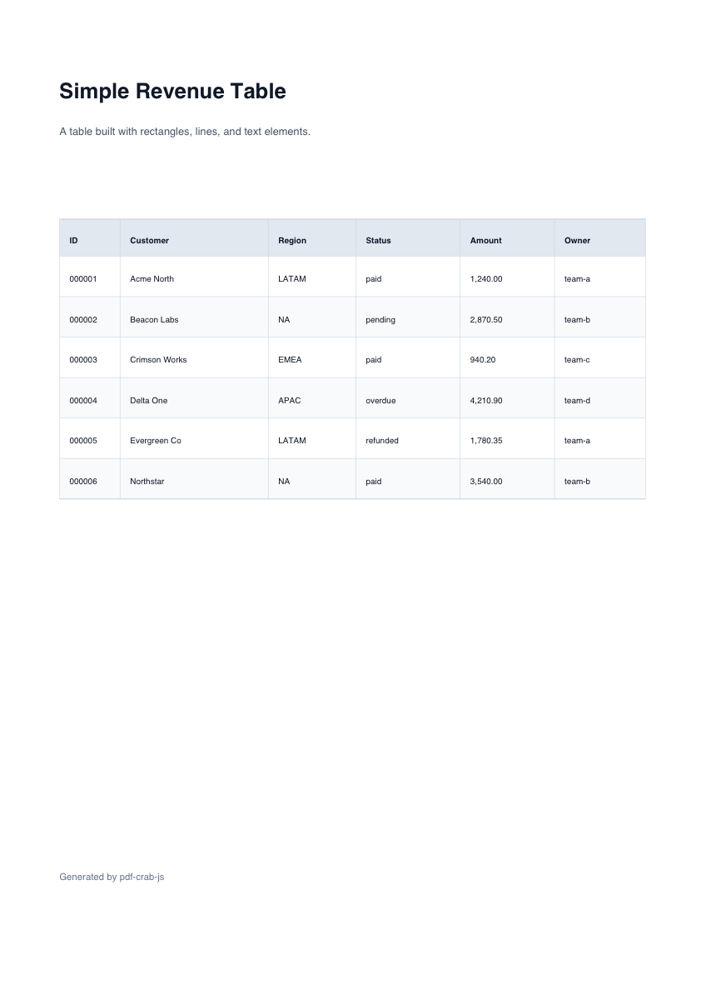

# pdf-crab-js

Fast structured PDF generation for Node.js and WebAssembly, built with Rust, NAPI-RS, and
`pdf-writer`.

Use this package when your application already knows the PDF structure: invoices, receipts,
statements, labels, reports, exports, tables, and other documents that can be expressed as pages,
coordinates, text, shapes, and links. If your source document is HTML and CSS, use
[`html-to-pdf-crab-js`](../html-to-pdf-crab-js/README.md) instead.

`pdf-crab-js` is the fast path in the Crab JS PDF stack. It avoids browser layout work and writes
PDF objects directly from a typed document model, making it a good fit for high-volume server jobs,
browser WASM generation, and documents where performance matters more than HTML authoring.

## Why pdf-crab-js

- Faster alternative for structured PDF generation when you can describe the document as pages,
  coordinates, text, shapes, and annotations.
- No Chromium, Puppeteer, Playwright, or Gotenberg service is required for the local native path.
- Same package shape for Node.js native bindings and the browser/WASI build.
- Complements `html-to-pdf-crab-js`: use `pdf-crab-js` for maximum speed, and use
  `html-to-pdf-crab-js` when HTML/CSS is the easier source format.

## Benchmark Snapshot

Local 10-page benchmark, fastest to slowest by execution time:

| Order | Language                | Mode       | Execution time |       Throughput |
| ----- | ----------------------- | ---------- | -------------: | ---------------: |
| 1     | Node + pdf-crab         | local      |       4.116 ms | 2429.253 pages/s |
| 2     | Node + pdf-crab         | builder    |       4.232 ms | 2362.863 pages/s |
| 3     | Node + html-to-pdf-crab | local-html |      62.327 ms |  160.443 pages/s |
| 4     | Node + Gotenberg        | gotenberg  |     128.304 ms |   77.940 pages/s |

Benchmark results are workload and machine dependent. The key takeaway is the shape: structured
PDF generation avoids HTML layout and remote Chromium overhead, so it is the fastest path for
documents you can model directly.

## PDF Result

This preview is generated from `examples/pdf-crab-js/table.ts`.



## Install

```bash
npm install pdf-crab-js
```

Requirements:

- Node.js `>=22` for the native package.
- A browser or static host with `SharedArrayBuffer` enabled for the WASM package.

## Quick Start

```js
import { writeFileSync } from 'node:fs'
import { createPdf } from 'pdf-crab-js'

const pdf = createPdf({
  title: 'Invoice',
  unit: 'mm',
  metadata: {
    title: 'Invoice',
    author: 'Finance Platform',
    creator: 'pdf-crab-js',
  },
  pages: [
    {
      width: 210,
      height: 297,
      elements: [
        {
          type: 'rect',
          x: 18,
          y: 240,
          width: 174,
          height: 34,
          fill: '#f8fafc',
          stroke: '#0f172a',
          strokeWidth: 1,
        },
        {
          type: 'text',
          text: 'Hello PDF',
          x: 26,
          y: 260,
          font: 'HelveticaBold',
          fontSize: 18,
          fill: '#0f172a',
        },
      ],
    },
  ],
})

writeFileSync('invoice.pdf', pdf)
```

CommonJS is also supported:

```js
const { createPdf } = require('pdf-crab-js')
```

## Builder API

Use `PdfDocumentBuilder` when the document is produced in chunks and you do not want to build one
large `pages[].elements[]` object before crossing the NAPI boundary.

```js
import { writeFileSync } from 'node:fs'
import { PdfDocumentBuilder } from 'pdf-crab-js'

const builder = new PdfDocumentBuilder({
  title: 'Chunked PDF',
  unit: 'mm',
})

builder.startPage({ width: 210, height: 297 })
builder.appendElements([{ type: 'text', text: 'Chunk 1', x: 20, y: 260 }])
builder.appendElements([{ type: 'line', x1: 20, y1: 250, x2: 120, y2: 250 }])
builder.endPage()

writeFileSync('chunked.pdf', builder.finish())
```

## API

| Export                  | Description                                                                            |
| ----------------------- | -------------------------------------------------------------------------------------- |
| `createPdf(input)`      | Synchronously renders a `CreatePdfInput` into a `Buffer`.                              |
| `createPdfAsync(input)` | Async version of `createPdf`.                                                          |
| `PdfDocumentBuilder`    | Incremental document builder with page, element, annotation, and async finish methods. |

### `CreatePdfInput`

| Field      | Description                                                                                        |
| ---------- | -------------------------------------------------------------------------------------------------- |
| `title`    | Optional document title.                                                                           |
| `unit`     | Coordinate unit. Supports `mm` and `pt`; defaults to `mm`.                                         |
| `metadata` | Optional PDF metadata: `title`, `author`, `creator`, `producer`, `subject`, `keywords`, `trapped`. |
| `pages`    | Array of PDF pages. Each page has `width`, `height`, `elements`, and optional `annotations`.       |

Coordinates use the PDF bottom-left origin. Page dimensions and coordinates use `unit`. Font sizes
and stroke widths are points.

### Elements

| Element   | Main fields                                                                                           |
| --------- | ----------------------------------------------------------------------------------------------------- |
| `text`    | `text`, `x`, `y`, `font`, `fontSize`, `fill`.                                                         |
| `textBox` | `text`, `x`, `y`, `width`, optional `height`, `fontSize`, `lineHeight`, `align`, `hyphenate`, `fill`. |
| `line`    | `x1`, `y1`, `x2`, `y2`, `stroke`, `strokeWidth`.                                                      |
| `rect`    | `x`, `y`, `width`, `height`, optional `fill`, `stroke`, `strokeWidth`.                                |
| `polygon` | `points`, optional `fill`, `stroke`, `strokeWidth`, `winding`. Requires at least 3 points.            |
| `path`    | `points`, optional `closed`, `fill`, `stroke`, `strokeWidth`, `winding`. Requires at least 2 points.  |

Colors use `#RRGGBB`. The structured PDF path supports the built-in PDF fonts: Times, Helvetica,
Courier, Symbol, and ZapfDingbats variants. `Helvetica` is used by default.

Bezier points are currently rejected by the `path` and `polygon` implementation; use straight
segments.

### Link Annotations

Pages can include link annotations:

```js
{
  type: 'link',
  x: 18,
  y: 17,
  width: 52,
  height: 10,
  url: 'https://github.com/flash-tecnologia/crab-js/tree/main/packages/pdf-crab-js',
  color: '#2f6fed',
}
```

## Browser and WASM

Browser, Deno, Bun, and portable runtimes can use the NAPI-RS WebAssembly build:

```js
import { createPdf } from 'pdf-crab-js/wasm'
```

Browser deployments must enable `SharedArrayBuffer`, which requires cross-origin isolation:

```text
Cross-Origin-Embedder-Policy: require-corp
Cross-Origin-Opener-Policy: same-origin
```

The combined Netlify browser sample lives in `examples/netlify-pdf-samples/` and demonstrates
`pdf-crab-js` with `html-to-pdf-crab-js` using the required WASM headers.

Published sample: https://pdf-crab-js.netlify.app/#pdf-crab-js

## Examples

Run the Node examples from the workspace root:

```bash
pnpm --filter pdf-crab-js-examples example
pnpm --filter pdf-crab-js-examples example:table
```

Generated files are written to `examples/pdf-crab-js/output/`.

Run the browser WASM example:

```bash
pnpm --filter pdf-crab-js-examples browser
```

Open `/wasm/` on the local Vite server. The page previews a structured `CreatePdfInput` object and
renders it into a PDF iframe.

## Development

Install dependencies from the workspace root:

```bash
pnpm install --filter pdf-crab-js
```

Build and test:

```bash
pnpm --filter pdf-crab-js build
pnpm --filter pdf-crab-js test
pnpm --filter pdf-crab-js check
pnpm --filter pdf-crab-js lint
pnpm --filter pdf-crab-js fmt:check
```

Build and smoke-test the WebAssembly binding:

```bash
rustup target add wasm32-wasip1-threads
pnpm --filter pdf-crab-js build:wasm
pnpm --filter pdf-crab-js test:wasm
```

Run the PDF table benchmark from the workspace root:

```bash
pnpm --filter pdf-benchmark benchmark
```

The benchmark defaults to a 10-page PDF with 10 table rows per page. Use `PDF_BENCHMARK_RUNS`,
`PDF_BENCHMARK_WARMUP`, `PDF_BENCHMARK_PAGES`, and `PDF_BENCHMARK_WRITE=1` to tune the run or write
the generated PDF to `benchmarks/pdf/output/`.

## Release

Native and WebAssembly package publishing is handled by `napi prepublish -t npm`.
